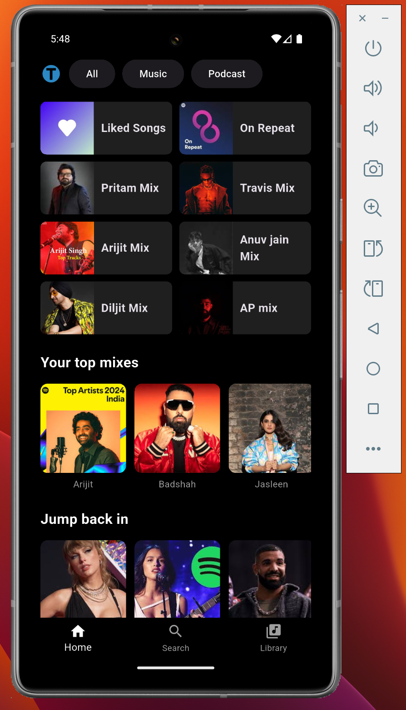
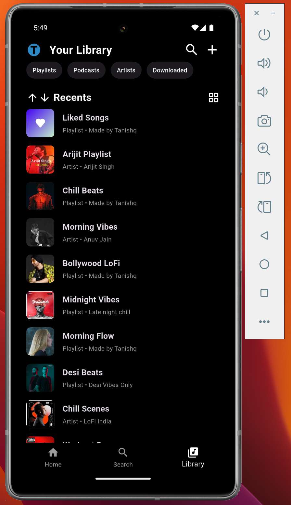

# 🎧 Spotify UI Clone with Flutter

A clean and beautiful UI clone of the Spotify app built using **Flutter**.  
This project is perfect for **Flutter beginners** who want to learn how to build modern UI and implement **basic navigation** in Flutter apps.

---

## 🧠 What You'll Learn

- How to **build UI layouts** in Flutter
- Use of **widgets like GridView, ListView, and AppBar**
- Implementing **navigation between screens**
- Designing with **Flutter's dark theme**

---

## ✨ Features

- 🎵 Custom AppBar with integrated search bar
- 🎧 Grid view layout for categories (Music, Podcasts, etc.)
- 🎶 Horizontally scrollable song or playlist cards
- 🌙 Fully dark-themed UI inspired by Spotify
- 📲 Beginner-friendly project structure

---

## 📸 Screenshots

| Home Screen | Search Page | Library Page |
|-------------|-------------|--------------|
|  |  |  |

---

## ⚙️ Tech Stack

- [Flutter](https://flutter.dev/)
- Dart

---

## 📁 Folder Structure

