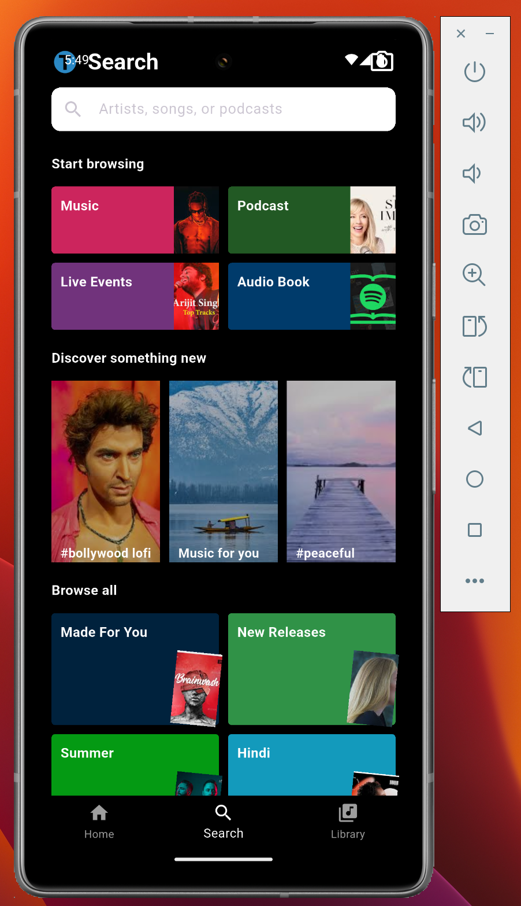

# 🎧 Spotify UI Clone with Flutter

A clean and beautiful UI clone of the Spotify app made using Flutter. This project focuses only on the frontend (no backend or audio playback).

## ✨ Features

- Custom AppBar with search bar
- Grid view for categories (Music, Podcasts, etc.)
- Horizontally scrollable song cards
- Dark theme UI inspired by Spotify

## 📸 Screenshots

| Home Screen | Search Page || Library Page |
|-------------|-------------||-------------|
|  |  ||  |

## 📱 Tech Stack

- Flutter
- Dart

## 🚧 Status

UI Complete (Frontend Only) – No audio or backend yet

## 📂 Folder Structure

